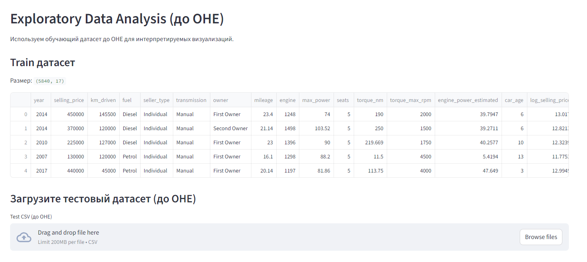
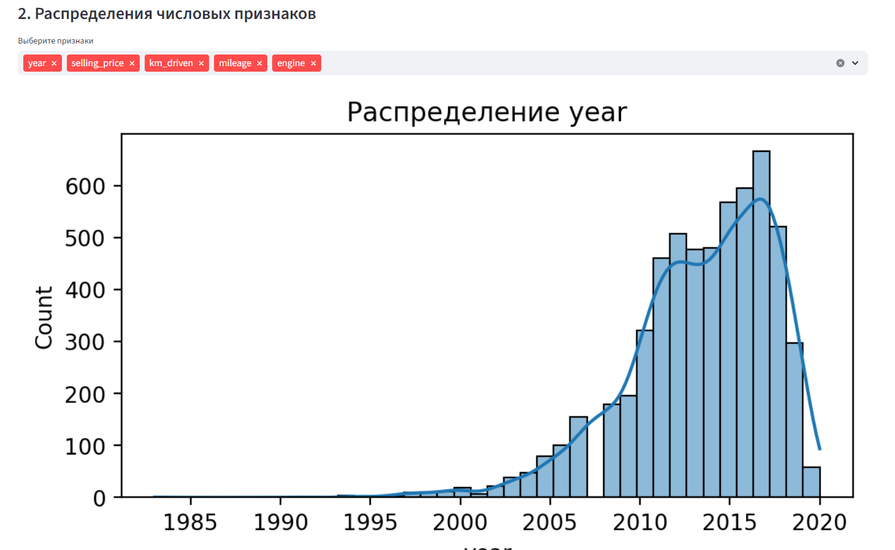
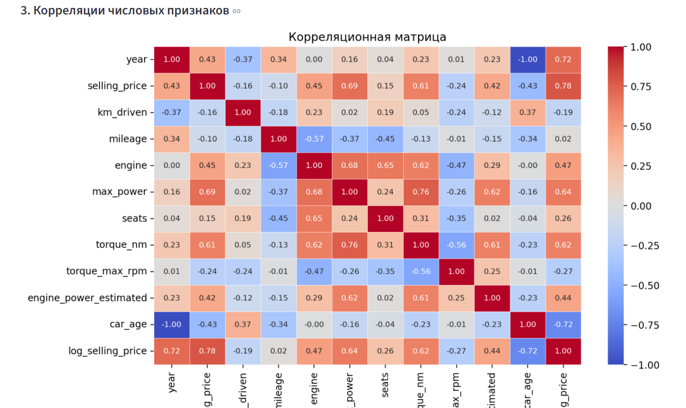
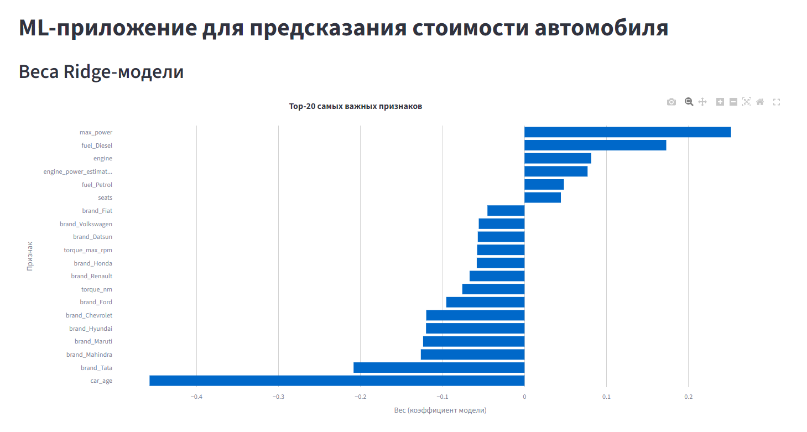

# Приложение для предсказания цены автомобилей

ML‑приложение для **предсказания стоимости автомобиля** с использованием Ridge-регрессии.
Что сделано:

- **EDA до и после обработки данных**
- **Предварительный анализ признаков и корреляций**
- **Подготовка данных и построение лучшей модели**
- **Просмотр весов Ridge‑модели**
- **Инференс по CSV с красивыми карточками результатов**
- **Streamlit UI**
- **Бандл модели**

---

## Структура проекта

```
HW1/
│
├── data/
│   ├── cleaned_test_before_ohe.csv               # Тестовый датасет до OHE
│   ├── cleaned_test_data_after_ohe.csv           # Тестовый датасет после OHE
│   ├── cleaned_train_before_ohe.csv              # Тренировочный датасет до OHE
│   ├── cleaned_train_data_after_ohe.csv          # Тренировочный после OHE
│
├── models/
│   └── best_model_bundle.pkl                     # Ridge‑модель + scaler + OHE‑фичи
│
├── notebooks/
│   └── HW1_Regression_with_inference_base.ipynb # Полный ноутбук экспериментов
│
├── pandas_profiler/
│   └── auto_price_report.html                    # Предварительный отчёт Profiling
│
├── src/
│   ├── figures/                                  # Скриншоты интерфейса
│   └── app.py                                    # Streamlit‑приложение
│
├── utils/
│   └── eda_plots.py                              # Функции EDA‑визуализаций
│
└── README.md
```

---

## Установка и запуск

### 1. Клонирование репозитория

```
git clone https://github.com/krasnovdanial/HomeWorkML.git
cd HomeWorkML
```

### 2. Установка зависимостей

По умолчанию используется **Poetry**:

```
poetry install
```

Если возникнут конфликты — можно установить зависимости через pip:

```
pip install -r requirements.txt
```

### 3. Запуск Streamlit

```
streamlit run HW1/src/app.py
```

Приложение откроется по адресу:

```
http://localhost:8501
```
Или вот работающая уже ссылка:
```
https://huggingface.co/spaces/Dan032/ml_homework
```
---

# ML‑пайплайн

Модель обучена на наборе признаков, связанных с характеристиками автомобиля:

- пробег (`km_driven`)
- мощность (`max_power`)
- двигатель (`engine`)
- крутящий момент (`torque_nm`)
- возраст авто (`car_age`)
- тип топлива (`fuel_*`)
- тип продавца (`seller_type_*`)
- трансмиссия (`transmission_*`)
- название модели (`name`)
- и другие признаки

### Используемая модель

- **Ridge Regression**
- **лог‑таргет (`log_selling_price`)**
- **StandardScaler**
- **One‑Hot Encoding**

Все необходимые объекты сохранены в:

```
models/best_model_bundle.pkl
```

Содержимое бандла:

- обученная Ridge‑модель
- scaler
- список признаков после OHE

---

# Интерфейс Streamlit

Используется датасет `cleaned_train_before_ohe.csv` для EDA

> **
> **
> **

---

## Веса Ridge‑модели

- топ‑20 наиболее значимых признаков
- визуализация через горизонтальный bar chart
-

> **

---

## Предсказание стоимости автомобиля

### Режим: загрузка CSV **после OHE**

Например: `cleaned_test_data_after_ohe.csv`.

Приложение выводит:

- карточки с предсказанными ценами
- таблицу с результатами
- гистограмму распределения предсказаний
- scatter‑графики влияния мощности и возраста

Пример карточки:

```
Mahindra
Предсказанная цена: 430 349 ₹
Пробег: 168000 км
Мощность: 112.0 hp
Возраст: 10 лет
```

> **

---

## Метрики Ridge‑модели

*(На тестовом наборе после OHE)*

- **RMSE:** 197,212.06
- **MAE:** 98,234.64
- **R²:** 0.89

Интерпретация:

- модель достаточно точная для данной задачи;
- ошибки умеренные, но снижать RMSE до диапазона 0.95–1.10 было бы лучше;
- модель стабильно предсказывает общую стоимость, но чувствительна к выбросам и редким категориям.

---

# Препроцессинг данных

Включает:

- очистку строковых признаков (мощность, крутящий момент)
- извлечение числовых значений из строк
- создание нового признака **car_age**
- One‑Hot Encoding категориальных переменных
- StandardScaler для числовых признаков
- лог‑преобразование таргета

### Наибольший прирост качества дали:

- логарифмирование `selling_price`;
- признак возраста;
- корректная очистка и нормализация мощности/крутящего момента.

---

# Формат входного CSV

Файл должен соответствовать OHE‑структуре, пример:

```
km_driven,mileage,engine,max_power,seats,torque_nm,torque_max_rpm,...
fuel_Diesel,fuel_Petrol,fuel_LPG,...
seller_type_Individual,seller_type_Trustmark Dealer,...
transmission_Manual,...
```

Для примера используйте:

```
data/cleaned_test_data_after_ohe.csv
```

---

# Стек технологий

| Компонент       | Технология                  |
|-----------------|-----------------------------|
| ML Model        | Ridge Regression (Sklearn)  |
| Data Processing | OHE + StandardScaler        |
| UI              | Streamlit                   |
| Визуализация    | Seaborn, Matplotlib, Plotly |
| Storage         | Pickle                      |
| Backend         | Python 3.10+                |

---

# Оценка разработанного сервиса

### Удалось реализовать хорошо:

- удобный и чистый интерфейс;
- расширенный EDA с аналитикой;
- продакшен‑стиль инференса через единый бандл;
- наглядные визуализации;
- информативные карточки предсказаний.

### Потенциальные улучшения:

- добавить ручной ввод признаков;
- улучшить обработку выбросов;
- реализовать SHAP‑интерпретацию модели;
- добавить k‑fold cross‑validation для повышения стабильности итоговой модели.
---
